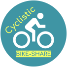

# Cyclistic Case Study

This is a case study about Cyclistic, a bike-share company in Chicago.

This analysis aims to find how do annual members and casual riders use Cyclistic bikes differently, as part of a marketing strategy aimed at converting casual riders into annual members.

The source data is too big to host on Github but is available [here](https://divvy-tripdata.s3.amazonaws.com/index.html), and is used under license by Motivate International Inc. and the City of Chicago.

The analysis is based on the work of Kevin Hartman.
